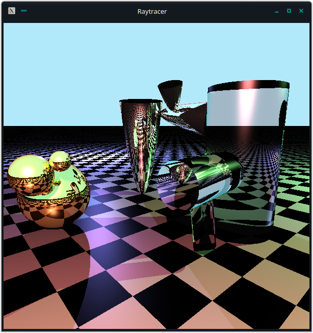

# Raytracer

This raytracer was written for a university assignment in 2011 for the Budapest University of Technology and Economics.
To build the raytracer simply run
```bash
make build
```
It will generate a `raytracer` executable. When run, it will generate the following image pixel by pixel using OpenGL.


